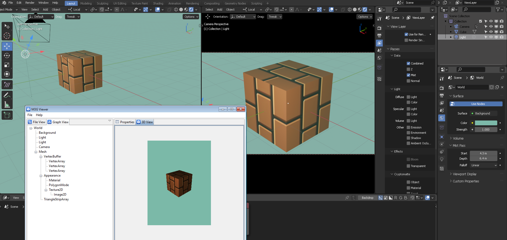
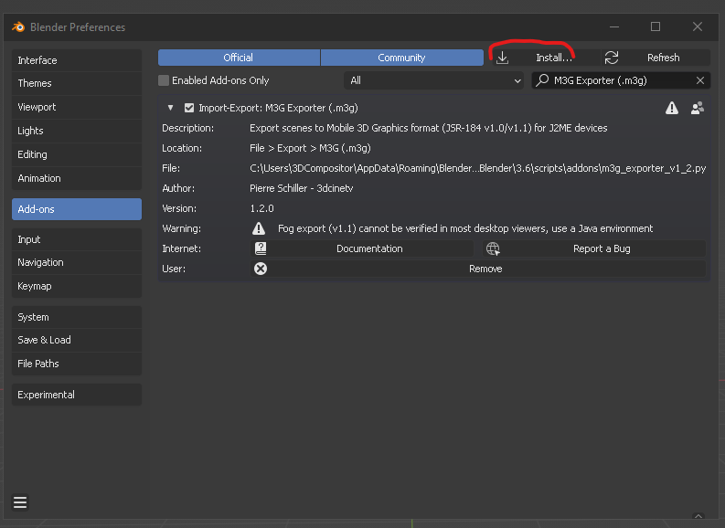
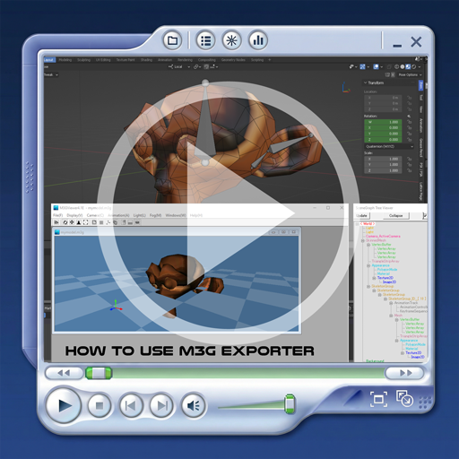

# 🟢BLENDER 3.6 M3G exporter FULL API compliant  #
## ⚠ _The updated addon was completed with TOP industry developers, this is not a casual update. This is a fully rewritten addon_ ##

# JSR-184 M3G Format
## Brief Evolution History (2003–2009)
JSR-184 (M3G) is a specification for a 3D engine Java API for J2ME. The .m3g format was created as part of JSR-184 to provide a way to deliver assets to applications using that API.
The JSR-184 `.m3g` specification was approved by the Java Community Process (JCP) in November 2003. It was introduced as the first standardized mobile 3D runtime format (_v1.0_) for J2ME (Java)-driven mobile phone devices, providing a retained-mode scene graph, animation system, and binary asset specification for mobile devices with differing hardware implementations, including those produced by Nokia (Symbian SDK) and Sony Ericsson (SE SDK). Through 2005, the .M3G format expanded with additional features (_v1.1_, including fog and depth).

HiCorp (JP) developed Mascot Capsule, a set of native functionalities (library) written in 'C' with Java wrappers so that they can be used with Java games. In 2004, OpenGL ES was defined, so Ver.4 of the Mascot engine includes both the Ver.3 API and an implementation of the Mobile 3D Graphics API (JSR-184) for J2ME, including their own render engine exclusively for Sony PlayStation and Sony Ericsson phones. This API ran integrated in different developer environments but not with a GUI until later years.

Mascot Capsule version 4 implemented JSR-184 'm3g'. Nokia, Superscape, and other companies developing for mobile media had implementations as well _(1)_, using the JSR-184 execution environment and API validation layer, effectively standardizing runtime behavior across devices for 90% of the Java video games at the time. Standardization of the behaviour was via the JSR-184 specification and the Nokia-produced TCK (technology compatibility kit) "we all had to pass before we could claim M3G compatibility"._(1)_

As videogame production pipelines scaled, `.m3g` served as a core intermediate 3D representation rather than a final shipping asset. HiCorp developed mbac/.mtra as proprietary models to translate high-end 3d software functions into a standard mobile videogame pipeline .mbac was the model format, and .mtra was the animation track format used in MascotCapsule v1 to v3. These formats predate .m3g _(1)_

The `.mbac` (_3d geometry_) and `.mtra` (_action information_) formats associated with Micro3D v3, preserved M3G semantics while enabling precompiled model and animation data when exported from high-end 3D DCC shader-language software. This evolution culminated around the end of 2006 with the `.h3t` container (Micro3D v4). "It was basically a text-based version of .m3g that we created at HI to help with 3D authoring" _(1)_

M3G 2.0 was proposed as the successor to the JSR-184 Mobile 3D Graphics (M3G) 1.1 specification, introducing a substantially enhanced rendering pipeline with support for programmable shaders, improved scene management, and integrated collision detection. The objective was to extend the fixed-function architecture of M3G into a more flexible and hardware-accelerated graphics framework while preserving compatibility with Java ME deployments.

Despite its technical advancements, M3G 2.0 was never widely implemented. Its development coincided with a fundamental shift in the mobile graphics ecosystem. The decline of Nokia, the primary commercial advocate of Java ME technologies, significantly reduced industry support for the platform. Simultaneously, advances in mobile GPU hardware enabled device manufacturers to expose lower-level graphics interfaces directly to Java ME applications, diminishing the need for a high-level abstraction layer such as M3G. The introduction of Apple's iPhone further accelerated this transition by establishing a native application ecosystem that excluded Java, contributing to the rapid decline of Java ME as a mainstream mobile platform. Collectively, these market and technological changes prevented the M3G 2.0 specification from progressing beyond the proposal stage and resulted in the absence of commercial implementations._(1)_

_(1 Note by Mark Callow - HiCorp developer at the time)_

[Official Java Community Process page for JSR-184 Mobile 3D Graphics API](https://jcp.org/en/jsr/detail?id=184)  
📘 [Official JSR-184 Mobile 3D Graphics API documentation](https://nikita36078.github.io/J2ME_Docs/docs/jsr184/)  
[JSR-184 byte layout and ObjectType ID structure](https://www.j2megame.org/j2meapi/JSR_184_Mobile_3D_Graphics_API_1_1/file-format.html#Fog)  
🎮 [3D/J2ME Video Game examples](https://youtu.be/bMm_wB7fJXk?si=xWzr94dA7wxjulIq)  

*Preview of a `.m3g` file exported from Blender and rendered in a real M3G viewer.*

## Overview

This add-on was developed to reestablish a missing production link between modern 3D authoring tools and the JSR-184 (`.m3g`) mobile 3D runtime format, enabling Blender to function as a precise authoring environment for legacy and preservation-oriented mobile graphics pipelines. It is intended for developers, retro modders, and 3D technical artists who require direct control over scene graphs, transforms, materials, and binary layout when targeting Java ME–based runtimes, emulators, and historical toolchains. The exporter follows a clean separation of concerns and respects JSR-184 object graph semantics instead of attempting to force Blender abstractions into the format, avoiding the historically common failure modes that rendered most earlier M3G exporters unusable in real runtimes.  

Artistically, it treats early mobile 3D constraints—limited lighting models, strict resource budgets, and simplified scene semantics—as intentional design parameters rather than limitations, enabling accurate reconstruction and extension of mobile-era 3D content. For more details on the differences between .M3G version _1.0 and 1.1_, please scroll to the end of this page.

---

## Blender .M3G .java 1.0 - 1.1 Addon.

This exporter generates **byte-accurate, JSR-184–compliant `.m3g` files** directly from Blender 3.6+ scenes. It translates Blender scene data into the M3G object model with explicit handling of transform hierarchies, vertex buffers, materials, lights, animations, and file structure, producing assets that behave correctly in real M3G runtimes and viewers rather than relying on visual approximation.

It explicitly solves the three historically fatal M3G problems that caused most legacy exporters to fail:

- Correct matrix layout (row-major, translation at indices 3 / 7 / 11)
- Correct coordinate system conversion (Blender Z-up → M3G Y-up, applied consistently)
- Correct file structure with header, content sections, and Adler32 checksums

M3G is not a loosely defined interchange format; it is a **strict runtime format** with precise binary and semantic requirements. Many past attempts treated it as a visual export problem rather than a runtime contract, leading to files that loaded inconsistently—or not at all—on real devices.

---

## ⭐ Supported Features

### ✨ Core Features

- Binary `.m3g` export (JSR-184 compliant)
- 22 JSR184 API Classes working directly in Blender and with Custom Property overrides
- Verified against real M3G runtimes:
  - M3G Viewer 0.3 (WizzWorks) / M3G Viewer (HiCorp)
- Correct matrix layout (row-major, translation at indices 3 / 7 / 11)
- Correct coordinate system (right-handed, Y-up, −Z forward)
- Scene hierarchy export (World → Groups → Nodes)
- World color or with texture node connected, will directly translate to Background color/Texture fixed in the background.
- FOG (from near / far camera plane) / Mist world pass settings for Linear/Quadratic falloff
- Cameras (Near / far planes, FOV, Perspective)
- Lights (Ambient, Sun _Directional_, Point _Omni_, Spot) / Intensity and Color can be animated
- ambientLight / foglight <---hardcoded names, can have custom properties to override scene's Ambient and Fog Light
- Materials (Diffuse, Roughness(_Shininess_), Specular, Emissive, Alpha) correct translation from BSDF node
- BSDF Material options (Alpha clip, Alpha blend, Opaque) supported (_aka: Compositing Mode_)
- Vertex Color support. If a texture exists, it multiplies against the texture (use a grayscale/b-w texture for correct color variation)
- Vertex color default attribute is "col" <--this is hard-coded to comply with Blender's default Vertex color name attribute property.
- Visibility animation from Blender (but must code it in .java to trigger)
- Vertex buffers, normals, triangle strips
- Rig Animation, Material/ Light/ Camera animation, Blendshape animation
- Object Parenting animation (no skinning) for faster (segmented body rig) playback
- ID Object tag, Action/NLA track ID tag with End frame to call animation controllers from Java
- Optional Java source export
- Java templates (simple viewer, full D-pad model exploration)
- Console verbose Full developer data export: ON (all technical specs) /OFF (Summary verbose)
- Custom Properties must be written at OBJECT properties.
- Sprite3D (billboard nodes from mesh+image, world-scale or pixel-size, crop rectangle, alpha factor, layer ordering)
- Sprite3D crop animation (CROP target — sprite sheet flipbook playback via custom F-Curves)
- MorphingMesh / Blend Shapes (shape key export with MORPH_WEIGHTS animation)
- SkinnedMesh (32-bone Rigify support, vertex group skinning, 3 influences per vertex auto-limit)
- Bone-parented rigid meshes (objects parented to bones, baked into bone-local space)
- NLA multi-action export (multiple actions per armature, one AnimationController per action, Java weight-switching)
- Quaternion sign normalization (w≥0 canonical hemisphere, prevents SLERP long-path artifacts)
- Euler rotation mode per bone (reads pose_bone.rotation_mode — handles Rigify's YXZ shoulders)
- Texture wrapping (REPEAT/CLAMP from Image Texture node extension property)
- Power-of-two texture warnings
- UserID tagging system (object #N and action #N parsers)
- Hex color parser for custom properties (supports "FFE49E", "#FFE49E", legacy "r,g,b")
- Camera FOV / near / far animation (new in v29)
- Fog density / distance animation via foglight custom property F-Curves (new in v29)
- Node alpha animation from BSDF Alpha input (new in v29)
- Pickability animation from custom property F-Curves (new in v29)
- Material animation — diffuse, ambient, emissive, specular, shininess all from BSDF F-Curves (new in v29)
- Background Image2D from World shader Image Texture node (new in v29)

---

## Technical Highlights

This exporter explicitly implements the parts of JSR-184 that historically caused incompatibilities, but are now correctly resolved:

- **Matrix layout:** M3G uses row-major matrices, not OpenGL-style column-major
- **Axis conversion:** Blender Z-up → M3G Y-up via a global −90° X rotation
- **Strict file structure:** Header + content sections + Adler32 checksums
- **Version targeting:** Defaults to M3G 1.0 for maximum compatibility; switches to M3G 1.1 only when Fog is explicitly enabled  

If Suzanne renders correctly in a real M3G viewer, the exported file is suitable for integration into a Java ME runtime.

---

## Installation (Blender 3.6+)

1. Download or clone this repository
2. In Blender:
   - Edit → Preferences → Add-ons → Install
   - Select `m3g_exporter_v1_x.py`
   - Enable **M3G Blender Exporter**
3. Export via:
   - File → Export → M3G (`.m3g`, `.java`)

---

## Export Workflow

1. Create or load a Blender scene
2. Ensure transforms, hierarchy, and shading are intentional
3. A Camera must exist in the scene to correctly export the .m3g
4. Add and position a point light (required for visible materials)
5. Assign a BSDF material (the diffuse slot color).
6. You can add simple 128x128 texture into the diffuse color of the BSDF
7. Fog parameters need World>Mist pass "start and depth", (quadratic/linear) values.
8. Export to `.m3g` or `.java`
9. Validate using an M3G viewer or runtime

  
*_click the above image to play the demo video_*

---

## Tested Runtimes

This exporter has been verified against real M3G execution environments:

- M3G Viewer 0.3 by WizzWorks
- M3G Viewer by HiCorp

If it works in these, your file is ready for J2ME environment.

---

## JSR184 ANIMATION

This exporter supports JSR-184 animation from Blender in the following list:

- ORIENTATION (268) — bone/node rotation via quaternion SLERP
- TRANSLATION (275) — bone/node position
- SCALE (270) — bone/node scale

- MORPH_WEIGHTS (266) — blend shape weights
- BONE rigs / Object parenting - Hierarchies with rotation

- SPOT_ANGLE (273) — Spotlight cone animation.
- SPOT_EXPONENT (274) — Spotlight falloff animation.

- INTENSITY (265) — YES, light intensity is animatable. You could keyframe a light's energy in Blender and export it as an INTENSITY track.
- COLOR (258) — Light color animation. Day/night cycle, alarm flashing, etc.
- ALPHA (256) — Node alpha factor. Fade in/out effects on any node.

- SHININESS (271) — Material shininess animation.
- DIFFUSE_COLOR (261) — Material color animation.
- EMISSIVE_COLOR (262) — Glow pulses.
- AMBIENT_COLOR (257) — Material ambient animation.
- SPECULAR_COLOR (272) — Specular animation.

- FIELD_OF_VIEW (264) — Camera FOV animation. Zoom/dolly effects.
- FAR_DISTANCE (263) — Fog/Camera far plane animation.
- NEAR_DISTANCE (267) — Fog/Camera near plane animation.
- DENSITY (260) — Fog density animation. Fog rolling in/out.

- CROP (259) — Sprite3D crop rectangle animation (sprite sheet playback!).
- VISIBILITY (276) — Show/hide toggle.
- PICKABILITY (269) — Enable/disable touch detection.
- Further animation implementations like physics / UV sliding / UI sprites / Impostors (trees / background planes), depend on Custom Properties and Java setup.

## Known Limitations

This is a first public release. Some features are intentionally conservative.  This repo will be updated constantly.

- Texture correction must be enabled. Two facing triangles without perspective correction warp the UV coordinates.
- M3G has a vertex limit of 65,535 tris.
- GLES vertex shading method limitation
- No normal calculation in blendshapes (_but could be implemented for post 2007 phones_)
- Export a character with armature modifier (MeshSkin) with 2 vertex weights' per bone influence maximum
- Textures are required to be in a square of 2 (16x16..., 24, 32, 64, 128, 256x256 pixels max).
- Always target the END resolution of your device's screen with your camera. Your scene in Java renders from camera (176x220)
- You cannot export a mesh with SkinDeform (weights) and Blendshapes. It's either one or the other. If the exporter finds such case, it will prioritize the SkinDeform (weights) Armature deformation.
- Materials require at least one Light to be visible (JSR-184 behavior)
- If you code your objects, make sure you are using CCW triangle strip arrays and feeding a normal array for surface shading (GL shading)
- ~~Textures and UVs are under active development~~ Done
- ~~Vertex colors supported but not yet default~~ Done
- ~~Shape keys / MorphingMesh planned, not complete~~ Completed
- ~~Skeletal animation export mesh deformation / blendshapes~~ Completed
- Fog viewing in Blender requires Compositor. But only World>Mist>start/depth values are sent to .m3g

All limitations are documented in code and tracked for future releases.

---

## Debugging Tips

**White / uncolored meshes**
- M3G requires at least one Light for diffuse materials
- Use ambient or emissive color during debugging

**Black background**
- Background color applies only if `World.setBackground()` is used
- `colorClearEnabled` must be true

**Inside-out meshes**
- Ensure CCW triangle winding
- Verify normal export and PolygonMode settings

---

## Roadmap
THIS ADDON IS CONSTANTLY IN DEVELOPMENT.
THIS REPO IS 3 versions BEHIND MY LOCAL DEVELOPMENT.

Planned next steps:

- Fog in hardware phones
- MorphingMesh (shape keys)
- Full skeletal animation tracks
- Improved diagnostics and logging

Contributions and testing feedback are welcome.

---

### Historic M3G Version Differences (JSR-184) from Version 1.0 to 1.1

#### New Features
- The Loader now supports all PNG color types and bit depths.
- The Node alpha factor now affects `Sprite3D`.
- Additional getter methods were added to allow all properties to be queried.
- The `OVERWRITE` hint flag was added to `Graphics3D.bindTarget`.

#### Removed or Relaxed Exceptions
- `Object3D.removeAnimationTrack` no longer throws `NullPointerException`.
- `Graphics3D.releaseTarget` no longer throws `IllegalStateException`.
- Several deferred exception cases were removed from `VertexBuffer`.
- The maximum target surface and viewport are no longer required to be square.
- `Group.addChild` no longer throws an exception if the `Node` is already a child of the `Group`.

#### New or Tightened Exceptions
- Target surfaces larger than the maximum viewport are no longer permitted in `Graphics3D`.

#### Resolved Interoperability Issues
- The default projection matrix is now required to be the identity matrix with projection type `GENERIC`.
- The Loader must treat all file names as case-sensitive.
- Mutable MIDP images are treated as RGB; immutable images are treated as RGBA.
- Flipping the sign of a quaternion during interpolation is explicitly disallowed.
- Downscaling behavior for sprite and background images is now well specified.
- The role of the crop rectangle when scaling sprites has been clarified.

## Historical Context

- Blender 2.49’s exporter targeted M3G 1.0
- Fog (ObjectType 7) was introduced in M3G 1.1
- Legacy exporters avoided Fog for compatibility

This exporter:
- Implements Fog according to the JSR-184 specification
- Exposes Fog only when explicitly enabled
- Prioritizes correctness over silent omission

Post-2006 production pipelines often used H3T (Micro3D v4) as a master format, with `.m3g` generated as a compatibility output via conversion tools. This exporter targets the last open, inspectable stage of that pipeline.

---
## ONGOING DEVELOPMENT (will be published soon)  
Summary of All Implementations for M3G Exporter v1.3.3  

A. VERSION & DOCUMENTATION UPDATES

Version bump: 1.3.2 → 1.3.3
Version history: Add JSR-184 Spec Compliance notes referencing 3DS Max documentation
Compatibility notes referencing 2004 original .m3g exporters from other DCCs (Metasequoia, 3DsMax)
Camera + Light is always required to comply with Scene validation.
Fog attachment comment: Document that fog must be attached to Appearance objects to be visible.

B. SPEC COMPLIANCE FEATURES (Already Working - Will Verify/Document)

Default mesh color: 0xFFFFFFFF (white) in M3GVertexBuffer - already correct
vertexColorTrackingEnabled: Set to True when vertex colors present - already implemented
MODULATE blending: Default texture blending mode (227) - already correct
Vertex color + texture interaction: Texture modulated by vertex colors - already working

C. VERTEX COLOR FIXES (Already Implemented in v19-2)

Vertex color matching in translateFaces(): Duplicates vertices at color boundaries
Per-face-corner color handling: Blender stores per-loop, M3G stores per-vertex
Alpha channel support: 3 components (RGB) or 4 components (RGBA) based on alpha detection

D. DEBUG OUTPUT REORGANIZATION  

[BYTE] - Binary/hex level operations (file writing, section building)
[WORLD] - World, Background, Groups, scene hierarchy
[MESH] - Mesh translation, materials, vertex colors, fog property attachment
[LIGHT] - Light translation, intensity, attenuation, color

----------

## License

This project is licensed under the GNU General Public License (GPL).  
See the LICENSE file for details.

---

## Author

**Pierre Schiller**  
3D Animator · VFX Compositor · AI Creator

Version Date Changes  
v1.02024 Initial refactor/rewrite from Blender 2.49 to Blender 3.6  
v1.12025 Fixed color space (linear→sRGB), material export  
v1.22025 Added fog support (M3G v1.1), version auto-switching

Credits

Blender 3.6 port & enhancements: Pierre Schiller  
JSR-184 Specification: Nokia Corporation, Java Community Process  
Research assistance: Claude (Anthropic), Gemini, Qwen, Chat GPT  
Inspired by the Blender 2.49 .py script by Gerhard Völkl (2005-2008)  
PS1 graphic aesthetics and [technical considerations](https://www.david-colson.com/2021/11/30/ps1-style-renderer.html)
